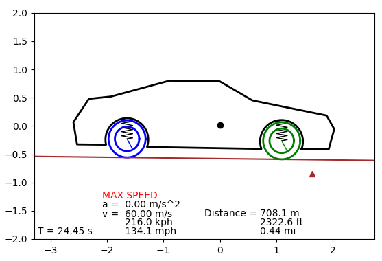
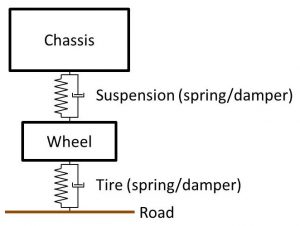
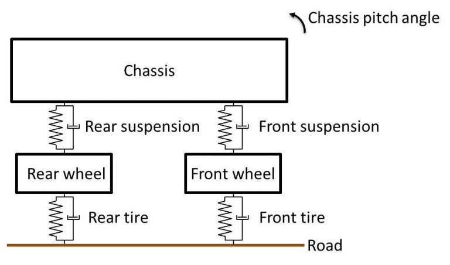
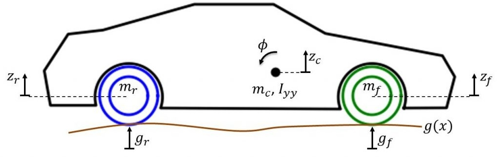
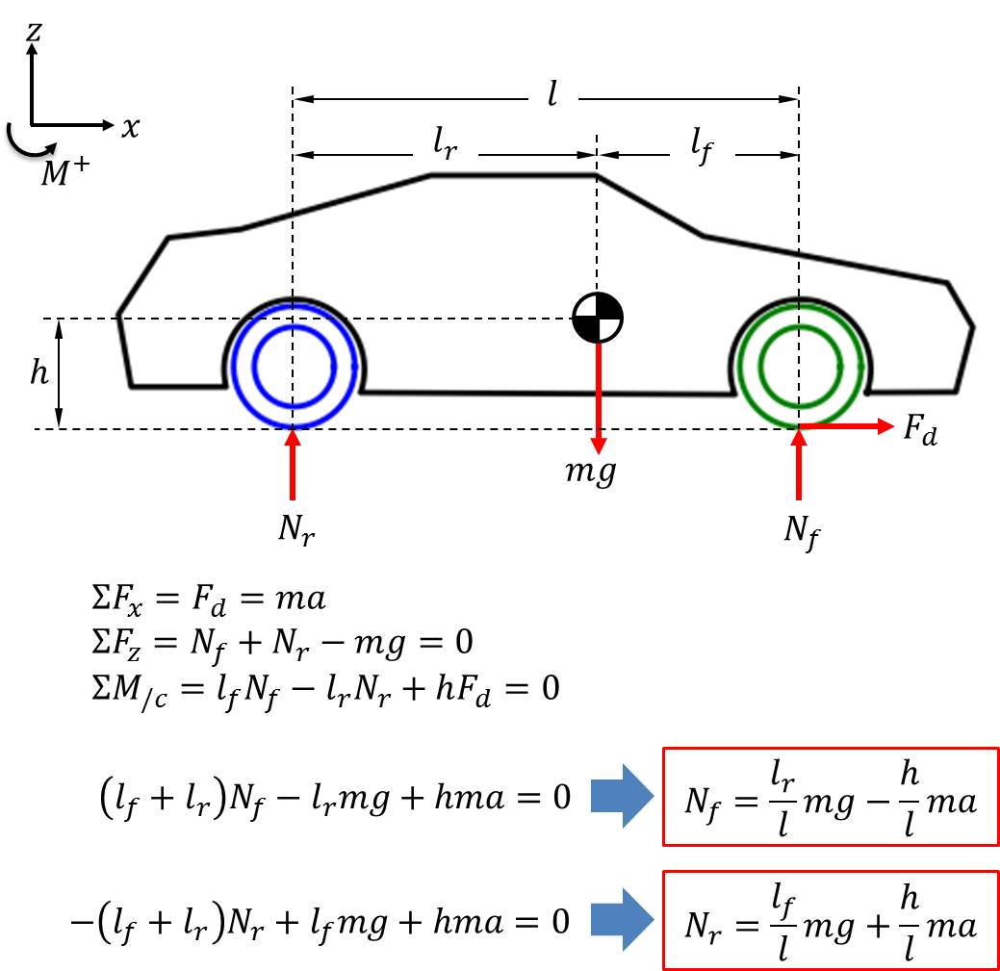
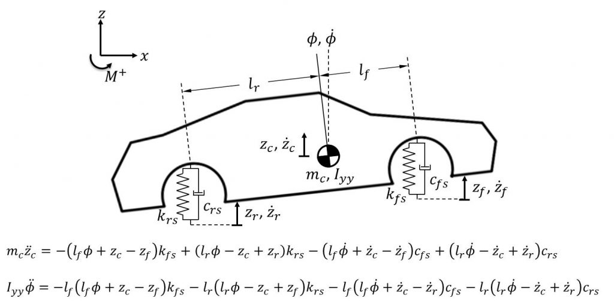
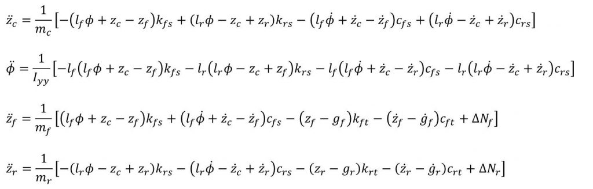

# Vehicle half-car suspension model

TODO

<a href="https://youtu.be/_CIp4ywYVUs"></a><br>
<a href="https://youtu.be/_CIp4ywYVUs">Watch video on YouTube</a>

```
git clone https://github.com/nrsyed/half-car.git
cd half-car
pip install -e .
python example.py
```

## Background

For a more detailed treatment of the theory, refer to 
<a href="https://nrsyed.com/2018/01/07/numerical-approach-to-studying-vehicle-dynamics-with-a-half-car-suspension-model/">
my original blog post</a>.

In the world of vehicle dynamics, a quarter-car suspension model considers a
single wheel, modeling both the suspension shock/strut and the tire as a
spring-mass-damper. This 1-dimensional, 2-DOF system consists of two differential
equations that can be solved to find the displacement of both the wheel
(the "unsprung mass") and the chassis (the "sprung mass") in response
to the input (the road).



A half-car model extends this to two wheels and adds two degrees of freedom,
forming a 4-DOF system of four differential equations that can be solved for
the vertical displacements of the front wheel, rear wheel, and chassis, as well
as the pitch (angular displacement) of the chassis.



In this case, the input (the road) must be evaluated at two points. The system
and aforementioned coordinates are shown below.



To characterize the system dynamics, the normal forces on the wheels must also
be taken into account, or more specifically, the change in the normal forces
in response to horizontal acceleration, which is based on the wheelbase (the
distance between the wheels and the distance of each from the car's overall
center of gravity). This phenomenon is what causes a car to pitch back when
accelerating and pitch forward when braking.



The four differential equations of the system (one corresponding to each
coordinate) can be derived by examining the chassis, which accounts for two of
the degrees of freedom, and the wheels. The differential equations
corresponding to the chassis are affected by the front and rear suspension and
the mass of the chassis.



Each wheel is affected by its corresponding suspension mechanism, the stiffness
and damping characteristics of the tire, the normal force on the wheel, and
the velocity and displacement of the road profile at the point of contact.


The accelerations are obtained by dividing through by the masses (in the case
of the vertical displacements) and the mass moment of inertia (in the case of
the angular displacement of the chassis).



Solving the dynamics of the system is a matter of solving this system of
differential equations. This can be done in a variety of ways, like the
<a href="https://en.wikipedia.org/wiki/Runge%E2%80%93Kutta_methods">
Runge-Kutta methods</a>, or with the
<a href="https://en.wikipedia.org/wiki/Euler_method">Euler method</a>,
which is used in this implementation.
